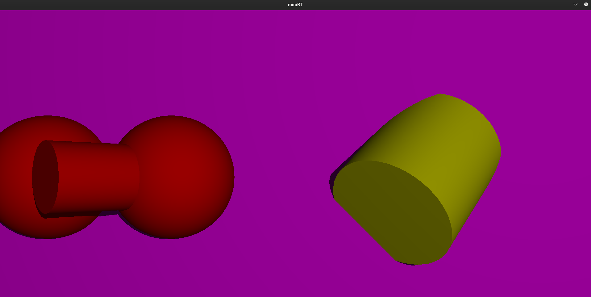
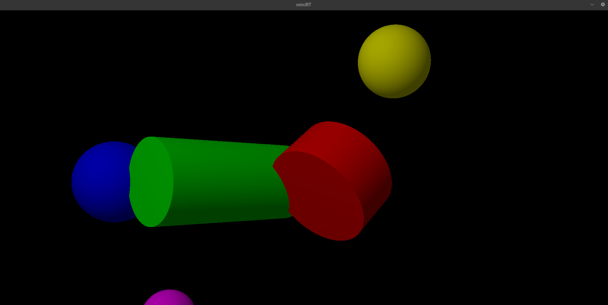
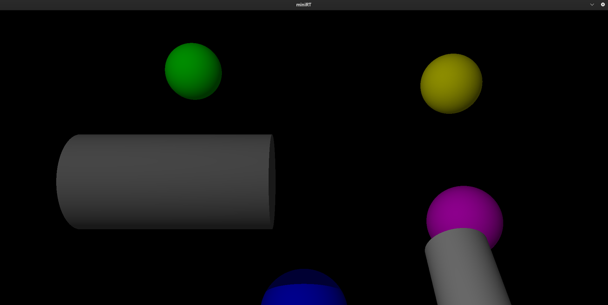
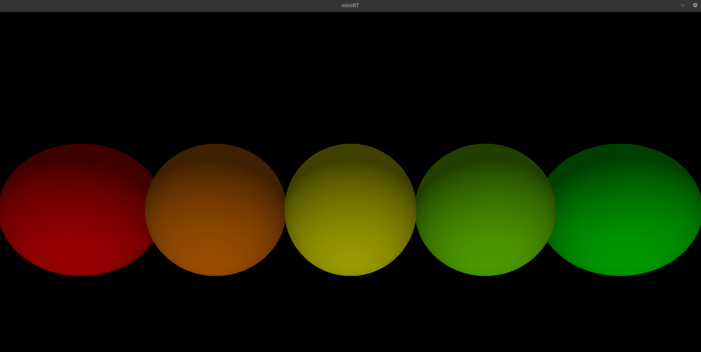
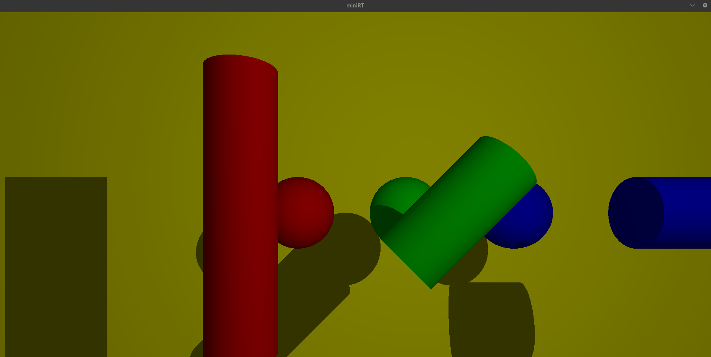
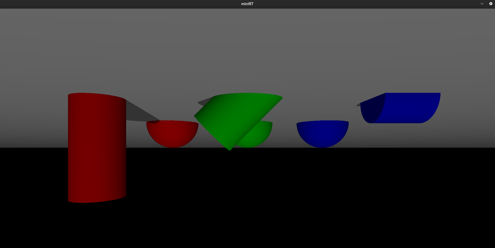

# miniRT - RayTracer with miniLibX

## Table of Contents

1. [Overview](#overview)
2. [Features](#features)
3. [User Controls](#user-controls)
4. [How to use](#how-to-use)
5. [Screenshots](#screenshots)
6. [Acknowledgments](#acknowledgments)

## Overview

miniRT is a RayTracer program that generates images of scenes using the Raytracing protocol. Each image represents a scene as seen from a specific viewpoint, defined by simple geometric objects and lighting systems. The project aims to create realistic computer-generated images using concepts of light reflection and refraction.

## Features

- **Geometric Objects**: Supports at least three simple geometric objects: plane, sphere, and cylinder.
- **Scene Description**: Parses a scene description file (`*.rt`) to set up the scene with cameras, lights, and objects. Examples of `*.rt` files are included in maps/.
- **Transformation**: Allows translation and rotation transformations for objects, lights, and cameras.
- **Lighting**: Implements ambient and diffuse lighting, spot brightness, hard shadows, and ambiance lighting.
- **Window Management**: Ensures fluid window management with the miniLibX library, handling window resizing and closure events cleanly.
- **Error Handling**: Properly exits with error messages for any misconfiguration encountered in the scene description file.

## User Controls

### Move Camera - Arrow keys

- **8 (Up)**: Move camera up.
- **6 (Right)**: Move camera right.
- **4 (Left)**: Move camera left.
- **2 (Down)**: Move camera down.

### Zoom In/Out:

- **+**: Zoom out.
- **-**: Zoom in.

### Note:

- The dimentions of the window are defined in includes/scene.h as CANVAS_WIDTH and CANVAS_HEIGHT.

## How to use

1. Clone the repository:
   ```sh
   git clone <repository-url>

2. Compile the project:
   ```sh
   make

3. Run the project with a test map:
   ```sh
   ./miniRT maps/maps/cyl_test.rt

## Screenshots

- 
- 
- 
- 
- 
- 

## Acknowledgements

- The 42 School for providing the project specifications and environment.
